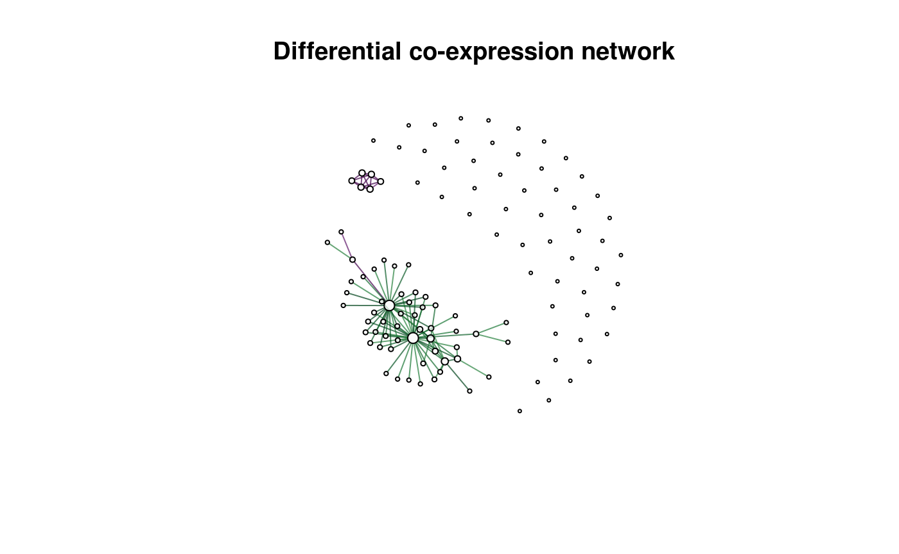

<!-- README.md is generated from README.Rmd. Please edit that file -->
dcanr: Differential co-expression/association network analysis
==============================================================

Methods and an evaluation framework for the inference of differential co-expression/association networks.

Installation
------------

You can install dcanr from github with:

``` r
# install.packages("devtools")
devtools::install_github("DavisLaboratory/dcanr")
```

Example
-------

This example shows how a differential network can be derived. Simulated data within the package is used.

``` r
library(dcanr)

#load simulated data
data(sim102)

#get expression data and conditions for 'UME6' knock-down
simdata <- getSimData(sim102, cond.name = 'UME6', full = FALSE)
emat <- simdata$emat
ume6_kd <- simdata$condition

#apply the z-score method with Spearman correlations
z_scores <- dcScore(emat, ume6_kd, cor.method = 'spearman')

#perform a statistical test: the z-test is selected automatically
raw_p <- dcTest(z_scores, emat, ume6_kd)

#adjust p-values (raw p-values from dcTest should NOT be modified)
adj_p <- dcAdjust(raw_p, f = p.adjust, method = 'fdr')

#get the differential network
dcnet <- dcNetwork(z_scores, adj_p)
#> Warning in dcNetwork(z_scores, adj_p): default thresholds being selected
plot(dcnet, vertex.label = '', main = 'Differential co-expression network')
```



Edges in the differential network are coloured based on the score (negative to positive represented from purple to green respectively).
